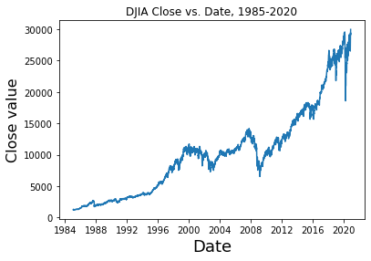
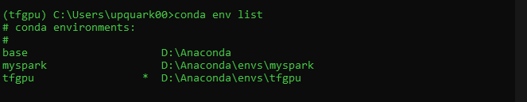
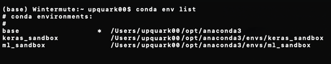
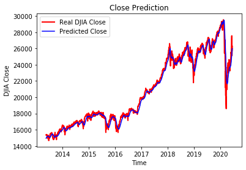

# Stock Predictor 

## Introduction 
Two main approaches exist in the realm of stock market forecasting: quantitative analysis, which is primarily informed by mathematical or statistical models, and fundamental analysis, which is substantiated by domain insight and company "fundamentals" (i.e., past financial statements, management information, balance sheets, etc.). 

In this project I will attempt to model the performance of the Dow Jones Industrial Average (.DJIA) via quantitative techniques. Expand to predict the S&P500 Index (.INX) and other indexes. Finally, infer movements of individual equities. 

##  Offshoots
- Train with Depression-era-specific data
- Train with sentiment analysis scores scraped from major sources of world news (Reddit is a good candidate, as it represents the "pulse" of the internet).
- Train with data surrounding turbulent elections

## Data 
The model was trained on Dow Jones Industrial Average data provided by Yahoo! Finance for the dates Jan. 28, 1985, through the present date (most current data pulled automatically). 



Of note, this set includes recent volatility stemming from the COVID-19 world health crisis, as well as data from the 2008 Financial Crisis. The goal is to determine total market trends in quarters II and III with a quantifiable likelihood. 

## Dependencies
I'm using Anaconda, a scientific Python distribution. Get it here: 

[Anaconda Download Page](https://www.anaconda.com/products/individual)

If this isn't your first time using Anaconda, please update conda first using 

``` $ conda update -n base -c defaults conda ```


### Virtual Environments are Snazzy
Before beginning, you may find it useful to create a virtual environment within your conda installation. A virtual environment functions like a "sandbox" such that any modules or libraries you install are isolated from your other system installations. It could allow, for example, two versions of Numpy to co-exist on the same machine, without any messy interactions. 

To see a list of virtual environments already installed on your system, enter this into your Anaconda shell (on Windows) or Terminal (Mac/Linux):

``` $ conda env list ``` 





Note the \* (asterisk), which indicates the environment that is currently activated. The active virtual environment also prefixes the command line with its name in (parenthesis). In the first image (Windows, green text), the active environment is (tfgpu). On the lower image (MacOS, white text), we are in (base).

And yes, Wintermute is a reference to the brilliant cyberpunk-futurist William Gibson. 

If you would like to create new environment, use the following code - and replace 'environmentname' with the name of your choice:

``` $ conda create --name environmentname ``` 

As mentioned above, only one virtual environment can be active per terminal session (this is marked by the \*). After creating a new environment, or when switching between environments, activate your selected environment using: 

``` $ conda activate environmentname ```

Read the documentation here: [VirtualEnvs in Anaconda](https://docs.conda.io/projects/conda/en/latest/user-guide/tasks/manage-environments.html)

### Check Necessary Libraries 
You'll need the libraries listed below to run this project on your local machine. Before installing again, you can check whether any of these is already installed on your system. In your shell of choice, enter the following commands, replacing 'numpy' as needed with each relevant module:

```
$ python 
>>> import numpy
>>> numpy.__version__
``` 

If you receive the following error, try the install commands below:

```
ModuleNotFoundError: No module named 'numpy'
```

To install Tensorflow (including Keras):

``` $ conda install tensorflow ```

Pandas:

``` $ conda install pandas ```

Matplotlib: 

``` $ conda install matplotlib ```

Numpy: 

``` $ conda install numpy ```

Yahoo Finance\*: 

``` $ pip install yfinance ```

\* Please note that the conda distribution of yfinance is not functional as of November 2011, and that ``` $ conda install yfinance $ ``` will not work.

## Project Structure
Datasets will be contained in a subdirectory named 'data.'

### Files
**get_data.py**: fetch most up-to-date stock information for a selected ticker and write this to a .csv, to be used by the model. 

**RNN.py**: builds and trains the LSTM model, makes predictions, and plots results. 

**model.h5**: a file containing a pre-saved, already-trained model. This file is created when RNN.py is run. Writing and loading a .h5 model prevents the need to perform training with every use of the predictor; i.e., RNN.py does not need to be explicitly run for every prediction. 

**run_me.py**: loads **model.h5** file (see above). Ultimately, this will be the only file that will need to be manually run. 

## Results


## See Also:

Anaconda Docs: https://docs.anaconda.com/

Yahoo! Finance on PyPi: https://pypi.org/project/yfinance/

Zou, Zhichao, and Qu, Zihao. "Using LSTM in Stock prediction and Quantitative Trading." 
http://cs230.stanford.edu/projects_winter_2020/reports/32066186.pdf

