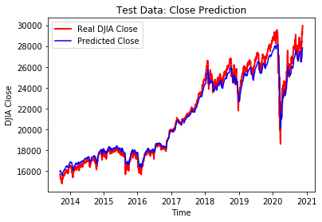

# Stock Predictor 

## Introduction 
Two main approaches exist in the realm of stock market forecasting: quantitative analysis, which is primarily informed by mathematical or statistical models, and fundamental analysis, which is substantiated by domain insight and company "fundamentals" (i.e., past financial statements, management information, balance sheets, etc.). 

In this project I will attempt to model the performance of the Dow Jones Industrial Average (.DJIA) via quantitative techniques. Expand to predict the S&P500 Index (.INX) and other indexes. Finally, infer movements of individual equities. 

##  Offshoots
- If possible, find and model Depression-era-specific data
- Compare predictions made via sentiment analysis

## Data 
The model was trained on Dow Jones Industrial Average data provided by Yahoo! Finance for the dates Jan. 28, 1985, through June 16, 2020. 

https://finance.yahoo.com/quote/%5EDJI/history?period1=475804800&period2=1592352000&interval=1d&filter=history&frequency=1d

Of note, this set includes recent volatility stemming from the COVID-19 world health crisis, as well as data from the 2008 Financial Crisis. The goal is to determine total market trends in quarters II and III with a quantifiable likelihood. 

## Dependencies
{ TBD }

## Project Structure
Datasets will be contained in a subdirectory named 'data.'

## Results

## See Also:
Zou, Zhichao, and Qu, Zihao. "Using LSTM in Stock prediction and Quantitative Trading." 
http://cs230.stanford.edu/projects_winter_2020/reports/32066186.pdf

